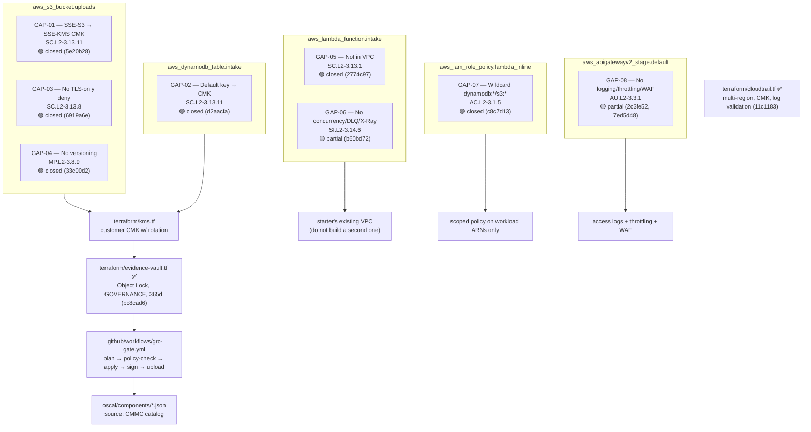
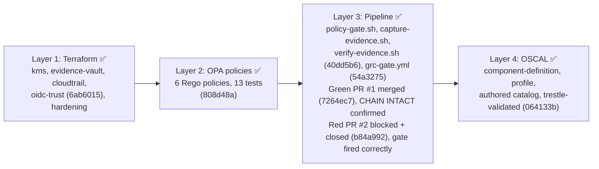

# Design Doc: Acme Health Evidence Pipeline

The working plan behind the write-up in `WRITEUP.md`. Where the write-up explains
the reasoning in prose, this doc holds the maps: which weakness lives on which
piece of infrastructure, which layer closed it, and which commit did the work.
Start with `WRITEUP.md` if you're reading for the argument; start here if you're
reading for the wiring.

## Framework decision

**CMMC Level 2.** Chosen over HIPAA and SOC 2 for the cleanest 1:1 mapping
between its NIST 800-171 control families and the 8 gaps in `GAPS.md`, not
because it's the natural regulatory fit for a telehealth company. See
`WRITEUP.md` → Primary framework for the full defense.

## Gap closure map

Which of the starter's eight weaknesses sat on which resource, and what closed it.
Boxes group the gaps by the resource they affected; arrows show what each group
was wired into to fix it.

Status legend: 🔴 open · 🟡 partial (documented limitation) · 🟢 closed (Terraform and/or policy)

## Repo layer plan

The four layers the capstone asks for, in the order they had to be built: each
one depends on the one before it working first.

## Terraform vs. policy split

The brief leaves it open whether each gap gets fixed in the infrastructure,
guarded by an automated check, or both. This is the per-gap reasoning behind
each of those calls, in full technical detail; `WRITEUP.md` carries the
readable summary.

| Gap | Close in Terraform | Enforce in policy | Reasoning | Commit |
|---|---|---|---|---|
| 01 | ✅ | ✅ | Closed in Terraform with SSE-KMS on the customer CMK. Also enforced in policy (`policies/gap01_s3_kms.rego`), so a future PR that reverts to SSE-S3 or removes the encryption config gets blocked at the gate instead of just fixed once and forgotten. | `5e20b28`, `808d48a` |
| 02 | ✅ | ✅ | Same as GAP-01 for a different resource type. Enforced in policy (`policies/gap02_dynamodb_kms.rego`), which checks `planned_values` directly since DynamoDB SSE is a nested block, not a separate resource. | `d2aacfa`, `808d48a` |
| 03 | ✅ |  | TLS-only deny is a static bucket policy. **Not** enforced in policy: its content lives inside a `jsonencode()`'d IAM policy document, which Terraform's plan JSON doesn't expose as a flat, reliably parseable string at the `configuration` level. Only an existence check (does *a* bucket policy exist at all) would be robust, and that wouldn't catch someone weakening the condition while keeping the resource. Also fixed in this commit: the Lambda role had no `kms:Decrypt`/`kms:GenerateDataKey` grant on the GAP-01/02 CMK. `make test` caught this as an `AccessDeniedException` after GAP-02 applied, so the grant is bundled into this commit. | `6919a6e` |
| 04 | ✅ | ✅ | Closed in Terraform, reused from the Lab 2.4 `compliant-s3` primitive. Enforced in policy (`policies/gap04_s3_versioning.rego`) and immediately proved its worth: running it against the real plan caught that the CloudTrail bucket (`aws_s3_bucket.trail`) also had no versioning, a gap the policy generalizes to catch on *any* bucket, not just the one named in GAPS.md. Fixed in `808d48a`. | `33c00d2`, `808d48a` |
| 05 | ✅ | ✅ | Moved into the starter's existing VPC (no second VPC built) per the brief's explicit constraint. Required two undocumented follow-ons: `AWSLambdaVPCAccessExecutionRole` for ENI permissions, and VPC endpoints (Gateway for S3/DynamoDB, Interface for KMS) since the private subnets have no NAT gateway. Chose endpoints over a NAT gateway for cost and to keep traffic on the AWS backbone. Enforced in policy (`policies/gap05_lambda_vpc.rego`) as an existence check on `vpc_config`, matching exactly how the original gap manifested (the block was entirely absent). | `2774c97`, `808d48a` |
| 06 | 🟡 partial |  | DLQ + X-Ray tracing added, with the X-Ray VPC endpoint pre-empted from the GAP-05 lesson (private subnet, no NAT). Reserved concurrency deliberately omitted: this account's Lambda quota is capped at 10 total and AWS enforces a 10-unreserved floor, so no positive reservation is possible here. Documented as a sandbox-account constraint, not silently skipped. Also: the DLQ only catches async-invocation failures; this Lambda is invoked synchronously by API Gateway, so it satisfies the gap's wording without being a fully effective control for this path. **Not** enforced in policy: given the partial/compensating-control nature already conceded here, a regression check would overstate how solid this control actually is. | `b60bd72` |
| 07 | ✅ | ✅ | Scoped to exactly what `handler.py` calls (`dynamodb:PutItem` and `s3:PutObject`), down from `dynamodb:*`/`s3:*`. Verified both paths directly post-apply: `make test` for DynamoDB, and a manual curl with `attachment_b64` + `aws s3 ls` to confirm the S3 write actually succeeds with the narrowed policy, not just assumed from the plan. Enforced in policy (`policies/gap07_lambda_least_priv.rego`) via a regex check on the planned policy string for any `service:*` wildcard action. This only works because in the real reintroduce-a-gap grading scenario the referenced ARNs are already known (existing infra), so the whole `jsonencode()` resolves to a literal string in `planned_values`; it would not work against a from-scratch `terraform plan` before any apply. | `c8c7d13`, `808d48a` |
| 08 | 🟡 partial | ✅ | Access logging and throttling both closed and verified live (a real request logged with status, IP, and response length; `aws logs tail` confirmed it). WAF deliberately not attached: WAFv2 web ACL association doesn't support HTTP APIs (`aws_apigatewayv2_api`) at all, only REST API Gateway stages, ALB, AppSync, Cognito, App Runner, and Verified Access. Fully closing this would mean fronting with CloudFront (which does support WAF) or migrating to a REST API, too much added infrastructure for one sub-item of one gap given the brief's "small, cleanly integrated" guidance. Documented as a known architectural limitation. A follow-up security review then caught two real issues in the first pass: the log resource policy had no source condition (confused deputy: any account's API Gateway could target the log group) and the log group wasn't using the customer CMK. Both fixed in `7ed5d48`, verified logs still land post-fix. Logging/throttling existence is enforced in policy (`policies/gap08_apigw_logging.rego`); WAF has no policy check since it was never built. | `2c3fe52`, `7ed5d48`, `808d48a` |

## Status

All 8 gaps closed or documented partial, matching the statuses in the diagram above. `WRITEUP.md`'s Control coverage table, Design decisions, evidence trace, and Trade-offs/What I didn't get to sections carry the full detail behind each one.
